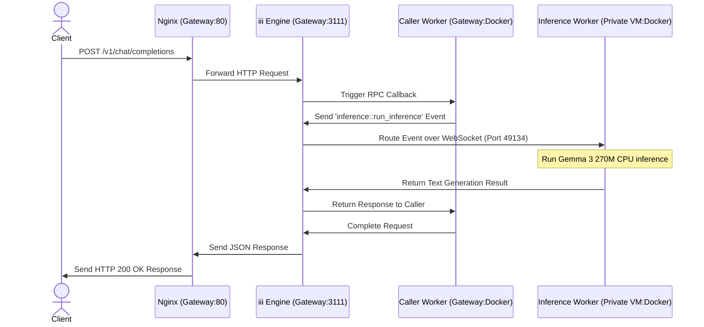

# Distributed SLM Inference System (DevOps Deployment)

This repository contains the infrastructure and code for a secure, distributed Small Language Model (SLM) inference system deployed on AWS. Utilizing Terraform for Infrastructure as Code (IaC) and Docker for containerization, the system runs the **Gemma 3 270M** model on private instances. Worker nodes communicate via the **iii framework** WebSocket RPC bus, while a public gateway exposes the service via an Nginx reverse proxy.

> [!NOTE]
> **Submission Status / Known Issues**  
> The core infrastructure (Terraform provisioning, multi-subnet network isolation, NAT Gateway, and Nginx proxy routing) is fully operational. However, the `inference-worker` container currently faces a startup issue during initialization, meaning the end-to-end inference `/v1/chat/completions` API endpoint is not yet fully functional.

---

## System Architecture


### Infrastructure Components

| Component | Host VM | Network Subnet | Runtime Stack | Responsibility |
| :--- | :--- | :--- | :--- | :--- |
| **Nginx** | `vm-gateway` | Public | Native Service | Reverse proxy, forwards inbound port 80 traffic to `iii` Engine |
| **iii Engine** | `vm-gateway` | Public | Rust Binary | Orchestrator, WebSocket RPC broker, HTTP API handler |
| **Caller Worker** | `vm-gateway` | Public | Bun / TypeScript | Registers `inference::get_response` RPC, delegates calls |
| **Inference Worker** | `vm-inference` | Private | Python / PyTorch | Loads Gemma 3 270M GGUF model, registers `inference::run_inference` |

### Network & Security Architecture

The deployment isolates resources using a multi-subnet VPC design (`10.0.0.0/16`) in the `ap-south-1` region:
* **Public Subnet (`10.0.1.0/24`)**: Hosts the gateway instance (`vm-gateway`). It is the sole public-facing node, allowing inbound SSH (port 22) from designated admin IPs and web traffic (port 80).
* **Private Subnet (`10.0.2.0/24`)**: Houses the inference engine instance (`vm-inference`). This subnet has no direct internet ingress. Outbound traffic (e.g., pulling Docker images or model files) is securely routed through an **AWS NAT Gateway** residing in the public subnet.
* **Internal RPC Messaging**: Communication between the gateway and inference worker utilizes local VPC routing via WebSocket (`ws://<gateway_private_ip>:49134`).
* **Bastion Host Pattern**: To ensure maximum security, the private inference instance cannot be accessed directly via SSH. Admin access requires tunneling/jumping through `vm-gateway` as a bastion host.

---

### Request & RPC Flow

Below is the sequence diagram illustrating how a public HTTP API request triggers private distributed LLM inference:



---

## API Endpoints

### Run Inference

* **Endpoint**: `POST /v1/chat/completions`
* **Headers**: `Content-Type: application/json`

**Sample Request**:
```bash
curl -X POST http://<GATEWAY_PUBLIC_IP>/v1/chat/completions \
  -H "Content-Type: application/json" \
  -d '{
    "messages": [
      {"role": "user", "content": "Explain gravity in one sentence."}
    ]
  }'
```

**Sample Response**:
```json
{
  "result": {
    "response": "Gravity is the force by which a planet or other body draws objects toward its center.",
    "success": "Inference successfully completed via distributed RPC workers."
  }
}
```

---

## Project Structure

```
alchemyst-devops-assignment/
├── docker/                  # Dockerfiles for containerized services
│   ├── engine/              # Configuration for the iii engine
│   ├── caller-worker/       # TypeScript/Bun execution container
│   └── inference-worker/    # PyTorch/Python CPU Gemma image
├── nginx/                   # Nginx reverse proxy configuration
├── quickstart/              # Local testing configuration & source files
│   ├── config.yaml          # iii Engine orchestration settings
│   └── workers/             # Codebase for both caller & inference nodes
│       ├── caller-worker/
│       └── inference-worker/
├── scripts/                 # Instance bootstrapping shell scripts
└── terraform/               # Infrastructure as Code resources
```

### Docker Image Registry

The system components are containerized and published on Docker Hub under the `cotishq` organization namespace:
* **Orchestrator**: `cotishq/alchemyst-engine` (Houses the `iii` engine binary and configuration)
* **API Router**: `cotishq/alchemyst-caller` (Bun + TypeScript caller-worker)
* **Inference Engine**: `cotishq/alchemyst-inference` (Python environment with PyTorch & Gemma 3 270M GGUF model)

---

## Setup and Deployment Guide

### Prerequisites

* Installed and configured **AWS CLI** with valid credentials (`aws configure`)
* **Terraform CLI** (version `>= 1.3`)
* **Docker Desktop / Engine** (for local testing/building if modifying source images)
* An active **AWS EC2 Key Pair** in the `ap-south-1` region

### Deployment Walkthrough

#### 1. Clone the Repository
Ensure you are in the project root:
```bash
git clone https://github.com/cotishq/alchemyst-devops-assignment.git
cd alchemyst-devops-assignment
```

#### 2. Configure Environment Variables
Create a `terraform.tfvars` file inside the `terraform` directory with your specific AWS context:
```bash
cat <<EOF > terraform/terraform.tfvars
aws_region = "ap-south-1"
key_name   = "your-ec2-keypair"
your_ip    = "$(curl -s https://checkip.amazonaws.com)/32"
EOF
```

#### 3. Provision Infrastructure via Terraform
Initialize and apply the configuration:
```bash
cd terraform
terraform init
terraform plan -out=tfplan
terraform apply tfplan
```
*Take note of the outputs: `gateway_public_ip`, `gateway_private_ip`, and `inference_private_ip`.*

#### 4. Bootstrap the Gateway Instance
Wait approximately 3 minutes for cloud-init bootstrap scripts to finish setting up the systems.

SSH into the Gateway instance to launch the API and Orchestrator containers:
```bash
ssh -i ~/.ssh/your-key.pem ec2-user@<GATEWAY_PUBLIC_IP>
sudo -i
cd /opt/alchemyst
docker compose up -d
```

#### 5. Bootstrap the Private Inference Node
Connect to the private inference instance through the Gateway instance, update the WebSocket address, and launch the inference service:
```bash
# SSH into Gateway first
ssh -i ~/.ssh/your-key.pem ec2-user@<GATEWAY_PUBLIC_IP>

# From the Gateway, SSH into the Private Inference VM
ssh -i ~/.ssh/your-key.pem ec2-user@<INFERENCE_PRIVATE_IP>
sudo -i
cd /opt/alchemyst

# Configure the private WebSocket target URL in docker-compose.yml
# Set III_URL to: ws://<GATEWAY_PRIVATE_IP>:49134
vi docker-compose.yml

# Launch the container
docker compose up -d
```

#### 6. Clean Up
To tear down the AWS resources:
```bash
cd terraform
terraform destroy
```

---

## Production Best Practices & Hardening

Prior to deploying this system to production, the following enhancements should be implemented:
* **Transport Layer Security (HTTPS)**: Implement SSL/TLS termination by placing an Application Load Balancer (ALB) in front of Nginx, or using Caddy with Let's Encrypt certificates.
* **Access Control & Auth**: Protect the public `/v1/chat/completions` endpoint by adding API key authorization, JWT verification, or OAuth2 middleware at the Nginx ingress layer.
* **Dynamic Secrets Management**: Secure connection strings, keys, and endpoints like `III_URL` by retrieving them at runtime from AWS Secrets Manager or Systems Manager (SSM) Parameter Store.
* **Telemetry & Monitoring**: Set up centralized log aggregation (e.g., AWS CloudWatch Logs via Fluent Bit) and monitoring metrics using Prometheus and Grafana (leveraging the OpenTelemetry hooks built into `iii`).
* **Access Security (SSM)**: Disable open SSH port 22 entirely on security groups, and utilize AWS Systems Manager Session Manager for shell access to nodes.
* **High Availability**: Deploy instances across multiple Availability Zones (Multi-AZ) and place them inside Auto Scaling Groups (ASGs) to automatically recover from hardware failures.
* **Payload Validation**: Integrate JSON schema validation at the gateway level to reject bad requests early before they consume precious downstream LLM worker cycles.

---

## Scaling for Large Models (e.g., 27B Parameters)

Scaling to support massive models requires upgrading the infrastructure and compute paradigm:
* **Accelerated Compute (GPUs)**: Migrate inference workloads from CPU instances to GPU-accelerated EC2 instances (e.g., `g5.xlarge` with NVIDIA A10G or `g6.xlarge`).
* **Decoupled Model Storage**: Instead of bundling massive weights in Docker images, store the GGUF/model weights on AWS Elastic File System (EFS) or S3, and mount/download them dynamically on instance boot.
* **Dedicated Inference Engines**: Replace standard PyTorch/Transformers pipelines with high-throughput engines like `vLLM` or `llama.cpp` server to benefit from continuous batching, KV caching, and optimized kernels.
* **Asynchronous Processing**: Decouple the request flow by putting an Amazon SQS queue between the gateway worker and the inference nodes. This prevents client timeouts during peak load or long generation times.
* **Predictive Autoscaling**: Configure Auto Scaling Groups for the inference worker pool based on SQS queue depth or custom CloudWatch metrics to dynamically handle load spikes.
